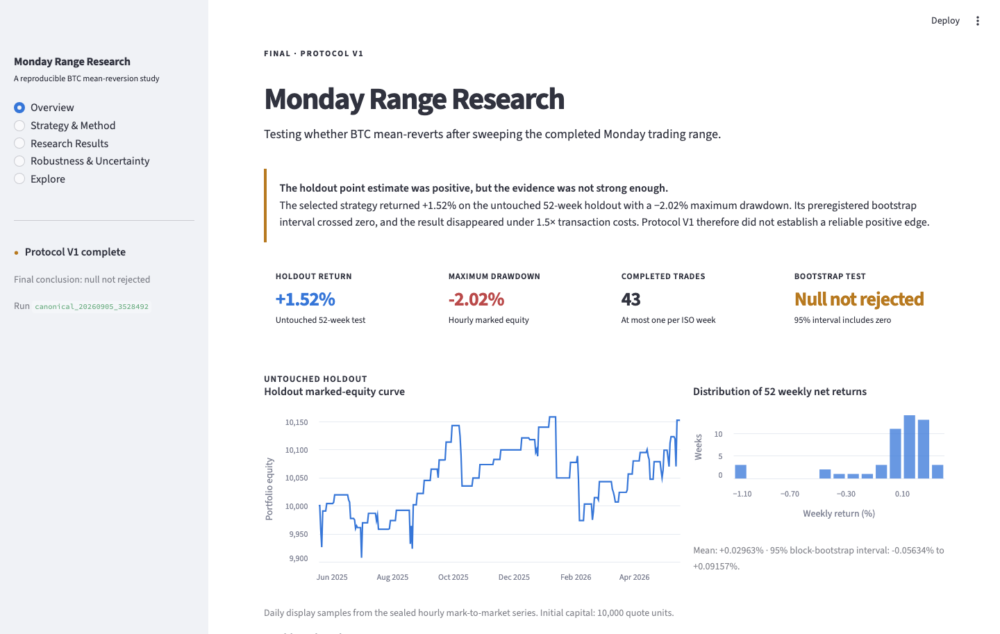
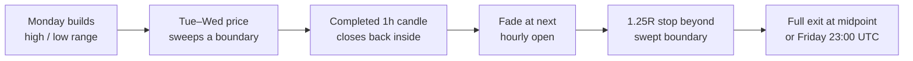
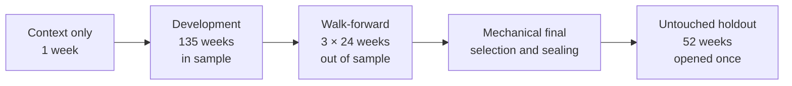
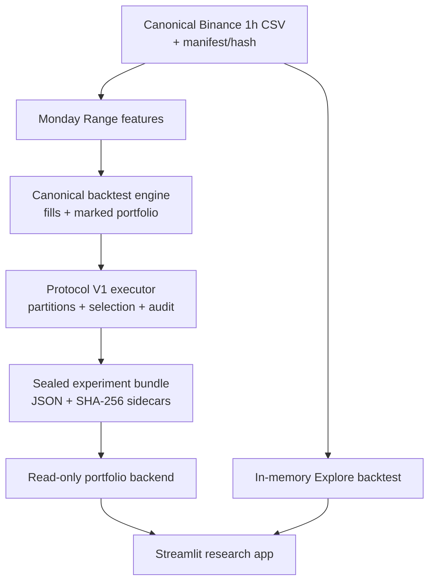

# Monday Range — BTC Quantitative Research

A reproducible study of whether BTC exhibits short-horizon mean reversion after sweeping the completed Monday trading range.

[](https://github.com/dnpjr/monday_range/actions/workflows/ci.yml)


> **Final finding:** The selected strategy returned **+1.52%** on the untouched 52-week holdout with a **−2.02%** maximum drawdown. Its 95% four-week moving-block bootstrap interval for mean weekly return was **−0.0563% to +0.0916%**. The interval includes zero, and the return became slightly negative at 1.5× costs. **Protocol V1 does not establish a reliable positive edge.**



## Research question

Does BTC tend to mean-revert after it trades beyond the completed UTC Monday range and an hourly candle closes back inside?

The hypothesis, data partitions, 18-candidate grid, selection objective, transaction costs, robustness checks, bootstrap, and holdout rule were frozen before corrected canonical performance was viewed. The holdout was opened once. No parameter or methodology changed afterward.

## Strategy



The final selected candidate is `mr1_stop125_day2_full_at_midpoint`:

- long plus explicitly labelled synthetic short positions;
- 1% risk from current marked equity;
- 1.0× maximum gross notional leverage;
- 10 bps fee and 5 bps adverse slippage on every fill;
- gap-aware fills and conservative stop-first OHLC handling;
- hourly bar-close mark-to-market accounting;
- at most one position-producing signal per ISO week.

Shorts are research positions evaluated on a **Binance spot price series**. They do not model spot borrowing, financing, or venue-specific short execution.

## Research design



| Stage | Dates, UTC `[start, end)` | Purpose | Net return |
|---|---|---|---:|
| Development | 2021-05-31 → 2024-01-01 | Candidate selection | +6.12% for the development winner |
| Walk-forward | 2024-01-01 → 2025-05-19 | Three unseen 24-week folds | **−7.16% aggregate** |
| Final pre-holdout fit | 2021-05-31 → 2025-05-19 | Select one sealed candidate | **−4.18%** |
| Final holdout | 2025-05-19 → 2026-05-18 | One-time confirmatory test | **+1.52%** |

Development and final-fit figures are in sample. The walk-forward and holdout curves remain separate throughout the app and report.

## Untouched holdout

| Metric | Result |
|---|---:|
| Net total return | **+1.5248%** |
| CAGR | +1.5292% |
| Mean weekly net return | +0.02963% |
| Maximum drawdown | −2.0218% |
| Sharpe / Sortino | 0.495 / 0.194 |
| Profit factor | 1.303 |
| Trades / win rate | 43 / 74.42% |
| Combined execution costs | 314.49 quote units |
| Net profit | 152.48 quote units |
| Bootstrap 95% interval | **−0.05634% to +0.09157% per week** |
| Preregistered decision | **Null not rejected** |

The frozen baseline returned −0.6203% over the same holdout. That comparison does not override the preregistered bootstrap decision.

## Robustness

| Frozen holdout diagnostic | Net return |
|---|---:|
| Canonical costs | +1.5248% |
| 1.5× costs | **−0.0580%** |
| 2× costs | **−1.5955%** |
| Target-first intrabar policy | +1.5248% |

Both long and synthetic-short contributions were positive in the holdout. Earlier walk-forward performance was negative in all three folds, pre-holdout calendar slices turned negative from 2023 onward, and every candidate in the frozen grid had a negative full pre-holdout return. The result is best read as a modest positive estimate surrounded by substantial uncertainty and cost sensitivity.

## Data and provenance

The canonical input is [`data/canonical/btcusdt_binance_spot_1h_v1.csv`](data/canonical/btcusdt_binance_spot_1h_v1.csv):

- BTCUSDT, Binance spot, 1-hour, UTC;
- 43,793 completed, sorted, unique, validated candles;
- 2021-05-21 15:00 UTC through 2026-05-20 14:00 UTC;
- no interpolation or forward filling;
- seven authoritative Binance gaps retained explicitly;
- SHA-256 `4d541711c323ac82e07bade75a522c0a48776c7d2e4eec7f45d8d9c4e00b41ce`.

Protocol SHA-256: `da0d41ce67d445bcb308012bf323d2e573d246a7a1fd3eb57c9ee6bc951d4cf3`

Canonical run: `canonical_20260905_3528492`
Research code commit: `352849299200b749496d588a1d7d1149503750fc`

The public app verifies the semantic SHA-256 sidecar for every sealed JSON artifact before displaying results.

## Architecture



The maintained path has one canonical dataset loader, strategy engine, metric implementation, protocol executor, and read-only presentation backend. The donor `crypto_research_lab copy` contributed no code: its regime work would introduce a separate, unsealed research question and a weaker duplicate resampling path.

## Run the dashboard

```bash
python3.11 -m venv .venv
source .venv/bin/activate
python -m pip install --upgrade pip
python -m pip install -r requirements.txt
python scripts/verify_release.py
streamlit run dashboard.py
```

The five pages are:

1. **Overview** — final conclusion, holdout equity, drawdown, and weekly returns;
2. **Strategy & Method** — accessible rules with execution and accounting details;
3. **Research Results** — separated development, walk-forward, and holdout evidence;
4. **Robustness & Uncertainty** — costs, bootstrap, direction, time, gaps, and parameter sensitivity;
5. **Explore** — an explicitly noncanonical, in-memory sandbox limited to pre-holdout dates.

Explore never writes to `reports/experiments/`, cannot overlap the consumed holdout, and cannot overwrite the canonical result.

## Reproduce and verify

```bash
python scripts/verify_release.py
python -m unittest discover -s tests -q
```

These commands verify the frozen protocol and dataset identities, both one-time holdout access markers, all sealed result sidecars, the canonical candidate and conclusion, strategy behavior, accounting, execution, leakage guards, bootstrapping, result loading, and all five app pages. They do **not** rerun the holdout.

Protocol execution code remains available for audit in [`run_protocol_v1.py`](run_protocol_v1.py) and [`src/protocol_v1.py`](src/protocol_v1.py). The final holdout is already consumed; do not invoke it again. See the [final research report](docs/research/MONDAY_RANGE_PROTOCOL_V1_FINAL_REPORT.md), [frozen protocol](docs/research/MONDAY_RANGE_PROTOCOL_V1.md), [methodology](docs/METHODOLOGY.md), and [deployment guide](docs/DEPLOYMENT.md).

## Repository map

```text
configs/research/     frozen machine-readable protocol
data/canonical/       immutable BTCUSDT input and manifest
src/                  strategy, engine, data, evaluation, protocol, UI backend
tests/                maintained scientific and presentation tests
reports/experiments/  one tracked sealed canonical experiment bundle
docs/research/        protocol, executor notes, and final report
archive/legacy/       superseded material retained for provenance
dashboard.py          public Streamlit application
```

## Limitations

- Hourly OHLC cannot resolve every intrabar path.
- Synthetic shorts omit borrowing, financing, and live venue constraints.
- This is a single-asset, single-venue historical study.
- Earlier exploratory strategy development creates broader data-snooping risk.
- The final test contains only 52 independent weekly units and 43 trades.
- Fixed fees and slippage omit latency, market impact, rejects, and operational failures.
- A finite grid winner is not a globally optimal strategy.

This repository demonstrates a controlled quantitative research process. It is not investment advice or evidence of a production-ready trading strategy.
